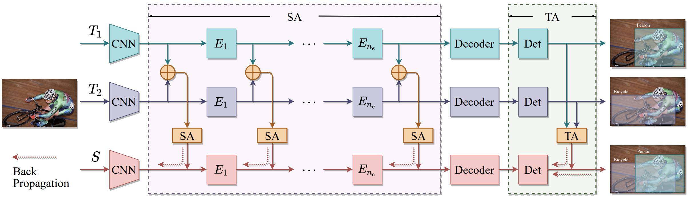

# Knowledge Amalgamation for Visual Transformers

> Some of the codes are modified from DETR and UP-DETR

*Official implementation for paper [Knowledge Amalgamation for Object Detection with Transformers](https://arxiv.org/abs/2203.03187)*

Authors: Haofei Zhang, Feng Mao, Mengqi Xue, Gongfan Fang, Zunlei Feng, Jie Song, Mingli Song



## Quick Start

### 1. Prepare dataset

* VOC-2012: download voc-2007+2012 dataset to folder `~/datasets/voc` (you may specify this in configuration files).
* MS-COCO-2017: download MS-COCO-2017 to folder `~/datasets/MS-COCO-2017` (you may specify this in configuration files).

### 2. Prepare cv-lib-PyTorch

Our code requires [cv-lib-PyTorch](https://github.com/zhfeing/cv-lib-PyTorch/tree/bootstrapping_vits). You should download this repo and checkout to tag `KA-DETR`.
> `cv-lib-PyTorch` is an open source repo currently maintained by me.

### 3. Train teachers

```bash
sh 1.train_teacher.sh
```

### 4. Train student with KA

Before training the student, you should modify the amalgamation config file (e.g., `config/voc/amalgamation/resnet50-amg-seq-task-no_cross.yaml`) so that the ckpt of all teachers are valid.

```yaml
teachers:
  t1:
    cfg_fp: config/voc/multitask/resnet50-t1.yaml
    weights_fp: /path/to/teacher1.pth
  t2:
    cfg_fp: config/voc/multitask/resnet50-t2.yaml
    weights_fp: /path/to/teacher2.pth
```

Train the student:

```bash
sh 2.KA.sh
```

## Citation

If you found this work useful for your research, please cite our paper:

```txt
@misc{zhang2022knowledge,
      title={Knowledge Amalgamation for Object Detection with Transformers}, 
      author={Haofei Zhang and Feng Mao and Mengqi Xue and Gongfan Fang and Zunlei Feng and Jie Song and Mingli Song},
      year={2022},
      eprint={2203.03187},
      archivePrefix={arXiv},
      primaryClass={cs.CV}
}
```
